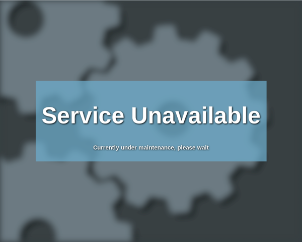
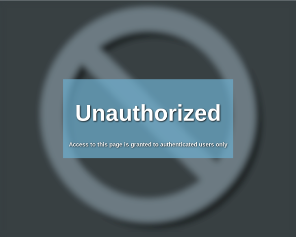

# Simple and neat html error page
50 lines of standalone minimal html for your users:
* while the backend services are unavailable (503)
* for unautenticated access (401)
* for resources not found (404)

**Service Unavailable**



**Unauthorized**



**Not found**


# Usage

Service Unavailable comes in 2 versions:
- unavailable.html, static
- unavailable-reload, contains a javascript background check for the backend service and page will automatically reload once available

## Example with HAProxy
Copy the content of the html file in your HAProxy configuration folder, add the following lines before.

```
HTTP/1.0 503 Service Unavailable
Cache-Control: no-cache
Connection: close
Content-Type: text/html

<Page Content>
```

Check file permissions, and add the **errorfile** directive to the defaults section of the haproxy configuration file (see [here](https://www.haproxy.com/blog/the-four-essential-sections-of-an-haproxy-configuration/)):

```
defaults
    log                        global
    option                     dontlognull
    option                     redispatch
    retries                    3
    errorfile                  503 /etc/haproxy/maintenance_page.http
```
